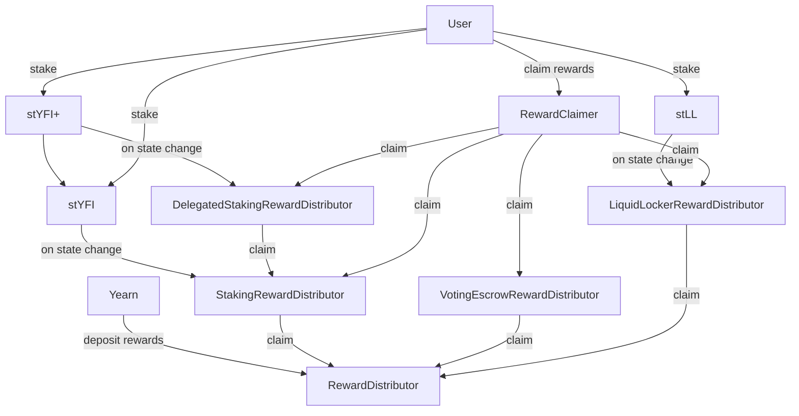

# stYFI

### Reward Distributor
The **RewardDistributor**'s task is to distribute token rewards each epoch to a set of components, distributing them proportionally to each component according to their self reported weight. Rewards for epoch `N` are claimable by each component in epoch `N+1` onward. Rewards are claimed in order.
Anyone is allowed to schedule rewards for a future epoch by depositing them into the contract. The contract can also pull in tokens from another contract, if configured.

The components that are intended to be added at launch are:
- StakingRewardDistributor
- LiquidLockerRewardDistributor
- VotingEscrowRewardDistributor

### Staked YFI
The **StakedYFI** contract is a ERC4626 vault that is 1:1 to the underlying token, YFI. It reports user operations to a hook. It does not allow instant withdrawals, except for addresses whitelisted by the hook. Unstaking burns the vault shares immediately and gradually releases the underlying tokens over a streaming period.

### Staking Middleware
**StakingMiddleware** is a contract that is supposed to be configured as the StakedYFI hook address. It contains a configurable list of addresses that are blacklisted from transfering their stYFI (unstaking is still allowed) as well as a list of addresses that are allowed to bypass the unstaking stream. It passes all operation hooks down to its configured address.

### Staking Reward Distributor
The **StakingRewardDistributor** will receive staking hook updates from the middleware. The contract snapshots the total amount of YFI staked each epoch to report as weight to the RewardDistributor. It will claim rewards as they become available, and stream them to stakers over the following epoch proportionally to their current balance. Rewards expire after a configurable number of epochs, after which they can be reclaimed by anyone, optionally with a bounty to the caller.

### Liquid Locker Depositor
Each of the three veYFI liquid lockers (LL) will have an instance of the **LiquidLockerDepositor** contract deployed, with their token as the underlying. It is a ERC4626 token that has a `1:S` ratio with the underlying, where `S` is set on deployment and is supposed to be equal to the amount of LL tokens divided by the amount of YFI they represent.
The token cannot be transfered and much like stYFI has an unstaking period. It also reports staking and unstaking operations to a hook contract.

### Liquid Locker Reward Distributor
The **LiquidLockerRewardDistributor** will be set to the hook contract of each of the 3 LL depositors. Similar to the reward distributor for stYFI, it claims tokens from the global reward distributor as they become available. However, the weight that is reported is not determined by the amount of staked tokens but rather by a preconfigured total weight and a decaying boost on top. Each of the 3 LLs have their own relative weight, which determines the share of the total rewards their stakers will receive.

### Liquid Locker Redemption
The **LiquidLockerRedemption** contract is a facility to allow anyone to exchange their LL tokens for YFI, at a fee that decays over time. It also allows anyone to move in the opposite direction at no fee, if there are any LL tokens available. Each token has a configurable capacity set, which is used up whenever LL tokens are redeemed and freed back up whenever the LL tokens are bought back.

### Voting Escrow Snapshot
Each of the veYFI locks (except the LLs) will have their veYFI balance and unlock time at the snapshot block recorded in **VotingEscrowSnapshot**. When querying this contract for a snapshotted lock it will check the veYFI contract and only report a lock if the user did not perform an early exit.

### Voting Escrow Reward Distributor
The **VotingEscrowRewardDistributor** is another component in the reward distributor, and reports a weight based on users with a veYFI lock snapshot that have migrated. Each migrated user has a weight equal to the amount of YFI in their lock and an individual decaying boost on top, based on the duration of their lock at time of snapshot. Any user early exiting out of their veYFI lock will lose their claim on future rewards and will have their unclaimed historical rewards reclaimed.

### Delegated Staked YFI
The **DelegatedStakedYFI** contract is another ERC4626 1:1 with YFI. It deposits the YFI into the StakedYFI contract and works with the assumption that it is configured to bypass its unstaking stream. This contract maintains its own unstaking stream which is functionally equivalent to StakedYFI. It also reports its own state changing operations (transfer/stake/unstake) to a hook contract.

### Delegated Staking Reward Distributor
The **DelegatedStakingRewardDistributor** will be the hook contract in the delegated staked YFI contract. Unlike the other distributors it is NOT intended to be a component in the global reward distributor. Instead it acts like a regular depositor into stYFI and claims rewards directly from the StakingRewardDistributor, and should be whitelisted there as such. Rewards are claimed on each user operation and are distributed proportionally according to the staked balances.

### Reward Claimer
None of the reward distributors require direct interactions from end users to claim their rewards. Instead the `RewardClaimer` is the user facing contract. It will claim rewards on their behalf from all the components at once.

The components that will be added at launch are:
- StakingRewardDistributor
- LiquidLockerRewardDistributor
- VotingEscrowRewardDistributor
- DelegatedStakingRewardDistributor

## Call flowchart


## Usage

### Install dependencies
```sh
# Install foundry
curl -L https://foundry.paradigm.xyz | bash
foundryup
# Install ape
pip install eth-ape
# Install required ape plugins
ape plugins install .
```

### Run tests
```sh
ape test
```
