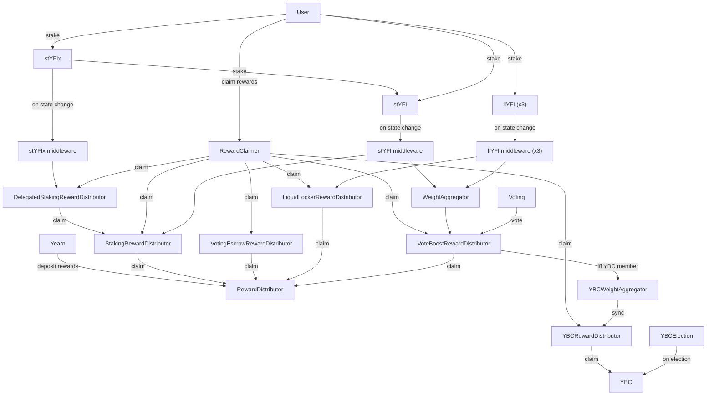
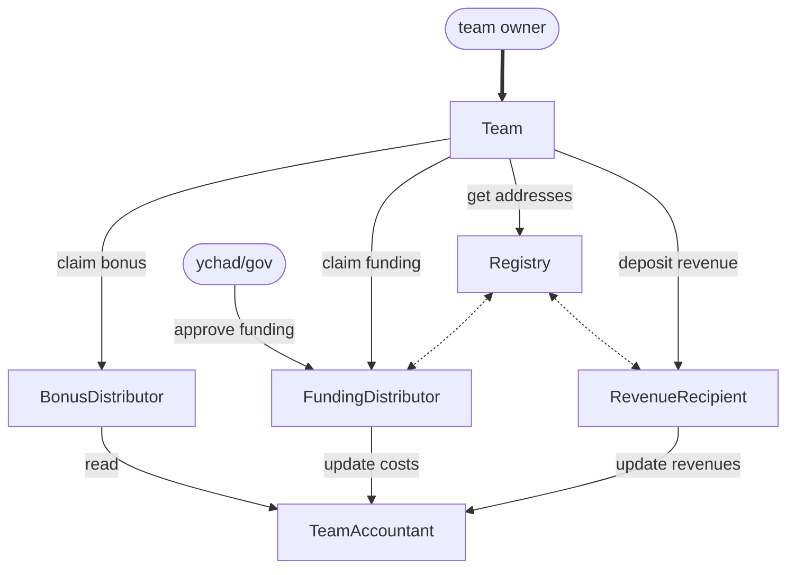

# stYFI

## Core components

### Reward Distributor
The **RewardDistributor**'s task is to distribute token rewards each epoch to a set of components, distributing them proportionally to each component according to their self reported weight. Rewards for epoch `N` are claimable by each component in epoch `N+1` onward. Rewards are claimed in order.
Anyone is allowed to schedule rewards for a future epoch by depositing them into the contract. The contract can also pull in tokens from another contract, if configured.

The components that are intended to be added are:
- StakingRewardDistributor
- LiquidLockerRewardDistributor
- VotingEscrowRewardDistributor
- VoteBoostRewardDistributor

### Staked YFI
The **StakedYFI** contract is a ERC4626 vault that is 1:1 to the underlying token, YFI. It reports user operations to a hook. It does not allow instant withdrawals, except for addresses whitelisted by the hook. Unstaking burns the vault shares immediately and gradually releases the underlying tokens over a streaming period.

### Staking Middleware
**StakingMiddleware** is a contract that is supposed to be configured as the StakedYFI hook address. It contains a configurable list of addresses that are blacklisted from transfering their stYFI (unstaking is still allowed) as well as a list of addresses that are allowed to bypass the unstaking stream. It passes all operation hooks down to two configured addresses, which are intended to be the StakingRewardDistributor and the WeightAggregator.

### Staking Reward Distributor
The **StakingRewardDistributor** will receive staking hook updates from the middleware. The contract snapshots the total amount of YFI staked each epoch to report as weight to the RewardDistributor. It will claim rewards as they become available, and stream them to stakers over the following epoch proportionally to their current balance. Rewards expire after a configurable number of epochs, after which they can be reclaimed by anyone, optionally with a bounty to the caller.

### Liquid Locker Depositor
Each of the three veYFI liquid lockers (LL) will have an instance of the **LiquidLockerDepositor** contract deployed, with their token as the underlying. It is a ERC4626 token that has a `1:S` ratio with the underlying, where `S` is set on deployment and is supposed to be equal to the amount of LL tokens divided by the amount of YFI they represent.
The token cannot be transfered and much like stYFI has an unstaking period. It also reports staking and unstaking operations to a hook contract.

### Liquid Locker Middleware
Each instance of **LiquidLockerMiddleware** is supposed to be configured as hook address of a LiquidLockerDepositor. It passes all hooks down to two configured addresses, which are intended to be the LiquidLockerRewardDistributor and the WeightAggregator.

### Liquid Locker Reward Distributor
The **LiquidLockerRewardDistributor** will be set as the hook contract in each of the 3 LL middlewares. Similar to the reward distributor for stYFI, it claims tokens from the global reward distributor as they become available. However, the weight that is reported is not determined by the amount of staked tokens but rather by a preconfigured total weight and a decaying boost on top. Each of the 3 LLs have their own relative weight, which determines the share of the total rewards their stakers will receive.

### Weight Aggregator
The **WeightAggregator** is designed to receive state updates from hooks on stYFI and the three llYFI components. It will keep track of the summed staked balance of every user and has two distinct usecases:
- The contract tracks a vote weight for every user that can be used in a governance system. Increases in staking balance cause the vote weight to ramp up to the full value over 4 epochs
- The aggregated balance and its changes are forwarded to the YBCWeightAggregator, where it can be used for YBC yield redistribution and voting purposes. Crucially the staking supply in these forwarded messages no longer include the supply of the individual component, rather they are replaced by the aggregated supply

Since this aggregator is deployed after launch, it has to be manually activated once. When activated it computes the total staked amount across all users and stores the value. In order for this contract to behave as expected the new middlewares should be injected atomically with the activation.

### Liquid Locker Redemption
The **LiquidLockerRedemption** contract is a facility to allow anyone to exchange their LL tokens for YFI, at a fee that decays over time. It also allows anyone to move in the opposite direction at no fee, if there are any LL tokens available. Each token has a configurable capacity set, which is used up whenever LL tokens are redeemed and freed back up whenever the LL tokens are bought back.

### Voting Escrow Snapshot
Each of the veYFI locks (except the LLs) will have their veYFI balance and unlock time at the snapshot block recorded in **VotingEscrowSnapshot**. When querying this contract for a snapshotted lock it will check the veYFI contract and only report a lock if the user did not perform an early exit.

### Voting Escrow Reward Distributor
The **VotingEscrowRewardDistributor** is another component in the reward distributor, and reports a weight based on users with a veYFI lock snapshot that have migrated. Each migrated user has a weight equal to the amount of YFI in their lock and an individual decaying boost on top, based on the duration of their lock at time of snapshot. Any user early exiting out of their veYFI lock will lose their claim on future rewards and will have their unclaimed historical rewards reclaimed.

### Delegated Staked YFI
The **DelegatedStakedYFI** contract is another ERC4626 1:1 with YFI. It deposits the YFI into the StakedYFI contract and works with the assumption that it is configured to bypass its unstaking stream. This contract maintains its own unstaking stream which is functionally equivalent to StakedYFI. It also reports its own state changing operations (transfer/stake/unstake) to a hook contract.

### Delegated Staking Middleware
The **DelegatedStakingMiddleware** contract will be the hook recipient from the delegated staked YFI contract. It passes all operation hooks down to a downstream address. It also snapshots the delegated supply at the last epoch boundary for governance purposes.

### Delegated Staking Reward Distributor
The **DelegatedStakingRewardDistributor** will be the downstream hook recipient in the DelegatedStakingMiddleware. Unlike the other distributors it is NOT intended to be a component in the global reward distributor. Instead the delegated staked YFI contract acts like a regular depositor into stYFI and this distributor claims rewards from the DelegatedStakingRewardClaimer, which in turn claims from the StakingRewardDistributor. Rewards are claimed on each user operation and are distributed proportionally according to the staked balances.

### Delegated Staking Reward Claimer
With the introduction of voting, delegated staking now receives rewards from two sources: staking and vote boosts. The **DelegatedStakingRewardClaimer** claims from both those components at the same time and forwards the rewards. It is intended to be configured as the address the DelegatedStakingRewardDistributor claims from, as that is only able to claim from a single source.

### Reward Claimer
None of the reward distributors support direct interactions from end users to claim their rewards. Instead the **RewardClaimer** is the user facing contract. It will claim rewards on their behalf from all the components at once.

The components that will be added are:
- StakingRewardDistributor
- LiquidLockerRewardDistributor
- VotingEscrowRewardDistributor
- DelegatedStakingRewardDistributor
- YBCRewardDistributor
- VoteBoostRewardDistributor

## Yearn Builder Collective (YBC)

### YBC
The **YBC** contract maintains the official list of members of the Collective. The contract is also supposed to hold the Collective's staking positions in stYFI and/or llYFI.
Outside adddresses can be whitelisted as operators, which allows them to call contracts on behalf of the YBC. This allows for a modular deployment of the YBC that can be iterated on if required.

Operators are also allowed to add and remove members to the YBC. These operations are also forwarded to a hook contract, which will be the YBCWeightAggregator.

The modules that will be added as operator are:
- YBCElection
- YBCRewardDistributor

### YBC Weight Aggregator
Sitting downstream from the global WeightAggregator, the **YBCWeightAggregator** is designed to aggregate staked stYFI and llYFI balances and voting weight for YBC members specifically. It is also supposed to receive membership updates from the YBC.

All upstream operations are translated as follows, depending on the membership of the involved users:
- Add member: treat as staking operation of entire balance
- Remove member: treat as unstaking operation of entire balance
- Transfer:
    - YBC -> YBC: treat as-is
    - YBC -> non-YBC: treat as unstaking operation
    - non-YBC -> YBC: treat as staking operation
    - non-YBC -> non-YBC: ignore
- Stake/unstake by YBC member: treat as-is
- Stake/unstake by non-YBC member: ignore

The translated operations are processed inside the aggregator and also forwarded further.

Much like the global weight aggregator this contract also keeps track of a weight. Note that this weight can be different from the global weight depending on the timing of when the user is added to the YBC.

### YBC Reward istributor
The **YBCRewardDistributor** will be added as YBC operator. As recipient of state updates from the YBCWeightAggregator, rewards are claimed from the YBC during each state change and redistributed according to each member's aggregated staked balance.

This component is supposed to be added to the RewardClaimer, allowing YBC members to seemlessly claim rewards from the YBC without any additional manual action.

### YBC Election
Membership of the Collective is regulated by the **YBCElection** contract. Any current member can nominate anyone else to be added to the Collective. Any current member can also nominate any member for expulsion from the Collective.

A proposal made in epoch `N-1` can be retracted in the same epoch and can be voted on in the second half of epoch `N`, leaving at least 1 week of discussion for any proposal. All YBC members are allowed to vote once on each proposal, with their vote weight determined by the YBCWeightAggregator. The only exception is that members are not allowed to vote on their own expulsion. To prevent last second manipulation, vote weights decay from full to 0 in the last 24 hours.

The vote ends at the end of epoch `N`. If a threshold fraction of votes is in favor of the proposal, the proposal is considered passed. Addition and expulsion votes have their own distinct configurable thresholds.

A passed proposal can be executed by anyone during epoch `N+1`. If a passed proposal is not executed during that epoch, it will become expired and cannot be executed anymore.

### YBC Bonus Recipient
The **YBCBonusRecipient** is a simple helper contract that takes in YFI deposits and stakes it into stYFI for the YBC.

## Governance

### Voting
The **Voting** contract manages the full lifecycle of governance proposals. A proposal consists of a IPFS hash and optionally a script to execute. Any user with minimum amount of voting weight is allowed to create proposals. A proposal created in epoch `N` is voted on at the end of epoch `N+1` and if passed becomes executable in `N+2`. A guardian is able to veto any proposal before it is executed, permanently preventing execution. In addition the guardian is allowed to appoint an operator which is allowed to flag spam/malformed proposals before they receive votes, preventing them from being voted on. Submitting votes is not done directly on this contract, rather it delegates this to a specialized contract which will be the Voter. This will allow implementation of advanced features such as delegations and weight decay without the need to redeploy the voting contract.
Proposals that reach at least the required threshold of votes in favor will become executable. Executions are passed on to a configured executor contract.

### Voter
The end-user will submit their votes on governance proposals to the **Voter**. This contract adds a linear weight decay near the end of the epoch. The contract also tracks the total vote for the YBC and stYFIx, which is determined by the blended votes of the YBC members, weighted by their YBC weight. Whenever a YBC member submits their vote, the new blended vote is determined and the updated votes for the YBC and stYFIx are submitted to the Voter contract.

### Executor
The **Executor** allows for execution of arbitrary function calls by whitelisted operators. It is intended to be used inside the voting contract. This contract should hold the privileged roles inside the protocol. This allows for easy swapping out of voting contracts by changing the operators without having to move the priviliged role to new contracts.

### Weight Measure
The governance voting weight is determined by the **WeightMeasure**. It sums up the weight from the WeightAggregator (which counts staked YFI and liquid locker YFI) and any migrated voting escrow position, if still active.
Because of the way the weight updates are processed inside the aggregator, it is not suitable to be used to determine the delegated staker weight. Instead this weight is taken as the weight from the DelegatedStakingMiddleware, which snapshots the total amount delegated at the end of the previous epoch.

### Vote Boost Reward Distributor
The **VoteBoostRewardDistributor** will be a component inside the RewardDistributor and RewardClaimer. The reward weight of each user inside this component is equal to their stake multiplied by their governance participation rate of the last 6 epochs. To achieve this the contract has hooks for vote operations and (un)stake operations. Any governance proposal is counted for 6 epoch, starting with the voting epoch. Whenever a user votes or (un)stakes, their weight is updated for 6 sequential epochs to `s_i * v_i / p_i`, where `s_i` is their total stake after applying the decaying legacy boosts, `v_i` is the number of counted votes and `p_i` the number of counted proposals in epoch `i`.

## Call flowchart

```mermaid
flowchart TD
    U[User]
    A[RewardDistributor]
    B[StakingRewardDistributor]
    D[VotingEscrowRewardDistributor]
    C[LiquidLockerRewardDistributor]

    E[stYFI] --> |"on state change"| J
    G[stYFIx] --> |"stake"| E
    F["llYFI (x3)"] --> |"on state change"| K

    G --> |"on state change"| S
    S[stYFIx middleware] --> H[DelegatedStakingRewardDistributor]
    H --> |"claim"| B

    Y[Yearn] --> |"deposit rewards"|A

    B --> |"claim"| A
    D --> |"claim"| A
    C --> |"claim"| A

    I["RewardClaimer"]
    I --> |"claim"| B
    I --> |"claim"| D
    I --> |"claim"| C
    I --> |"claim"| H
    I --> |"claim"| N
    I --> |"claim"| Q
    U --> |"claim rewards"| I

    U --> |"stake"| E
    U --> |"stake"| G
    U --> |"stake"| F

    J[stYFI middleware]
    J --> B
    J --> L

    K["llYFI middleware (x3)"]
    K --> C
    K --> L

    L[WeightAggregator]
    M[YBCWeightAggregator]
    L --> Q
    Q --> |"iff YBC member"| M

    N[YBCRewardDistributor]
    M --> |"sync"| N
    N --> |"claim"| P

    P[YBC]
    O[YBCElection]
    O --> |"on election"| P

    Q[VoteBoostRewardDistributor]
    Q --> |"claim"| A

    R[Voting]
    R --> |"vote"| Q
```

## Teams

### Team Registry
The **TeamRegistry** tracks the official list of currently active teams. It also points to the current implementation of the RevenueRecipient and FundingDistributor to be used by the teams for depositing revenue and claiming funding respectively.

Teams can be added to the registry by specifying a unique name and the team owner. This deploys a minimal proxy to the current Team contract implementation and adds it to the registry. Once added, teams can be permanently marked as retired. A team that is marked as retired in epoch `N` will no longer be able to claim funding or deposit revenue in epoch `N+1` and onwards.

Teams operate on so-called budget periods. Each budget period lasts 6 stYFI epochs (12 weeks), with the budget genesis 12 weeks before the stYFI genesis (Feb 05, 2026).

The registry can be marked deprecated in favor of a newer deployment. When a registry is deprecated all of the teams can be notified of migration to the new version with a permissionless call.

### Team
A team is represented by a proxied instance of the **Team** contract, deployed by the factory and registered in the TeamRegistry. Each team has a name and an owner. The owner can transfer ownership to a new address.

Approved funding requests can be claimed on the Team contract by the owner, which will fetch the address for the funding distributor from the TeamRegistry and claim the funding from it.

Anyone is able to deposit revenue on the Team contract, which will fetch the address for the revenue recipient from the TeamRegistry and deposit the revenue to it.

### Team Accountant
The **TeamAccountant** is a simple contract tracking revenues and costs (in USD) per team, as well as globally, for each epoch and over its lifetime. It also exposes utility functions for profits (if any) and loss (if any).

Contract maintains a list of operators that are allowed to adjust costs and revenues of teams upwards or downwards. Changing these values also automatically updates the global and lifetime values appropriately.

The operators that are intended at launch are:
- RevenueRecipient
- FundingDistributor

### Revenue Recipient
Teams depositing revenue on their Team contract will have their revenue routed to the **RevenueRecipient**. The current implementation is temporary, it will be replaced by a fully autonomous version in the future.

Deposited revenue is priced by the configured oracle and then credited as USD revenue in the TeamAccountant.

The recipient only accepts whitelisted tokens, which can be converted on deposit by a configurable converter. At launch the only whitelisted tokens will be USDC and yvUSDC-1, where USDC is automatically converted to yvUSDC-1 by the RevenuePriceOracle.

In this iteration of the contract management is allowed to manually distribute yvUSDC-1 between stYFI, treasury and yETH recovery. This is done to give maximum flexibility while teams get used to the new on-chain requirements.

### Revenue Price Oracle
The **RevenuePriceOracle** provides prices for a 4626 vault and its underlying naked token. The underlying is fixed at $1 and the vault token is priced using `convertToAssets`.

This contract also provides funcionality to convert the underlying token into the vault token for usage inside the RevenueRecipient.

### Funding Distributor
Approved funding requests are submitted to the **FundingDistributor**. The process of submission will be through yChad at launch but can be replaced by an on-chain governance process in the future.

Funding submissions are distinguished by the following parameters: team address, budget period, funding token, token amount and stream duration.

Once a funding approval is submitted, the team owner can claim the funding through their registered Team contract, which then calls the FundingDistributor. Partial claims are supported and each claim can have a distinct recipient. Funding is only counted as a cost inside the TeamAccountant when it is claimed, not before. Claims can only be done in the same epoch they are approved for.

The stream duration that is specified with the approval is counted from the beginning of the budget period, meaning late claims will have a shorter stream. Claims initiated after the stream would have expired will not be wrapped in a stream but will receive the full token amount immediately.

Unused funding can be returned through the Team contract, which sends the funding back to the FundingDistributor. This will reduce the cost of the team inside the TeamAccountant using the average price of all the claims.

### Bonus Distributor
After every budget period teams can claim bonus YFI through the **BonusDistributor**. The amount of bonus token each team receives is determined by their profit. The bonus token is priced by the BonusPriceOracle. The price is then adjusted based on the global revenue growth of all teams, optionally after applying EMA smoothing and a cap in both directions. This mechanism rewards teams for revenue growth and punishes them if revenue shrinks.

### Bonus Price Oracle
The **BonusPriceOracle** prices the bonus token in USD. Prices can be set manually. The latest completed period can also have its price set based on the current ChainLink oracle spot price.

## Team flowchart

```mermaid
flowchart TD
    O([team owner])
    A[Team]
    B[Registry]
    C[RevenueRecipient]
    D[FundingDistributor]
    E[TeamAccountant]
    F([ychad/gov])
    G[BonusDistributor]

    O ==> A
    A --> |deposit revenue| C
    A --> |get addresses| B
    A --> |claim funding| D
    A --> |claim bonus| G
    G --> |read| E
    B <-.-> C
    B <-.-> D
    F --> |approve funding| D

    C --> |update revenues| E
    D --> |update costs| E
```

## Usage

### Install dependencies
```sh
# Install foundry
curl -L https://foundry.paradigm.xyz | bash
foundryup
# Install ape
pip install eth-ape
# Install required ape plugins
ape plugins install .
```

### Run tests
```sh
ape test
```
