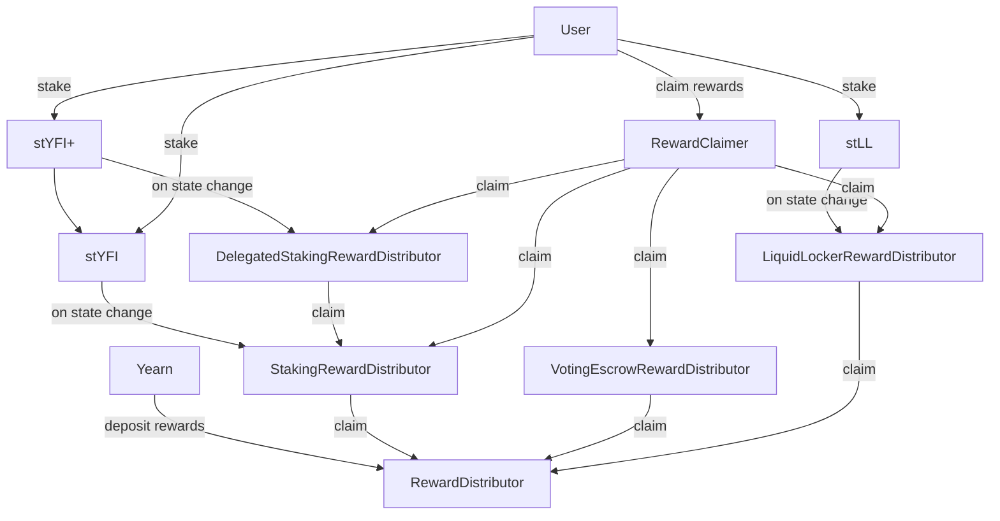
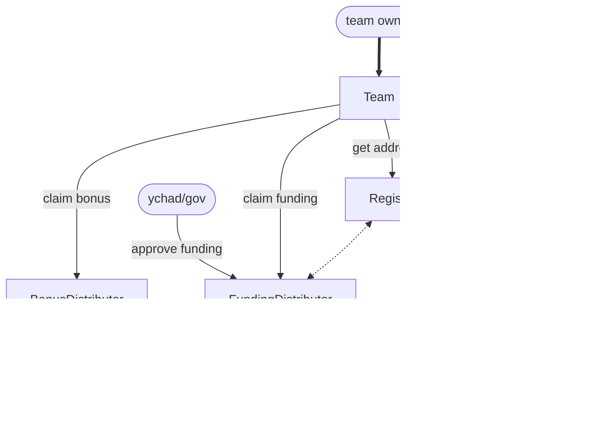

# stYFI

### Reward Distributor
The **RewardDistributor**'s task is to distribute token rewards each epoch to a set of components, distributing them proportionally to each component according to their self reported weight. Rewards for epoch `N` are claimable by each component in epoch `N+1` onward. Rewards are claimed in order.
Anyone is allowed to schedule rewards for a future epoch by depositing them into the contract. The contract can also pull in tokens from another contract, if configured.

The components that are intended to be added at launch are:
- StakingRewardDistributor
- LiquidLockerRewardDistributor
- VotingEscrowRewardDistributor

### Staked YFI
The **StakedYFI** contract is a ERC4626 vault that is 1:1 to the underlying token, YFI. It reports user operations to a hook. It does not allow instant withdrawals, except for addresses whitelisted by the hook. Unstaking burns the vault shares immediately and gradually releases the underlying tokens over a streaming period.

### Staking Middleware
**StakingMiddleware** is a contract that is supposed to be configured as the StakedYFI hook address. It contains a configurable list of addresses that are blacklisted from transfering their stYFI (unstaking is still allowed) as well as a list of addresses that are allowed to bypass the unstaking stream. It passes all operation hooks down to its configured address.

### Staking Reward Distributor
The **StakingRewardDistributor** will receive staking hook updates from the middleware. The contract snapshots the total amount of YFI staked each epoch to report as weight to the RewardDistributor. It will claim rewards as they become available, and stream them to stakers over the following epoch proportionally to their current balance. Rewards expire after a configurable number of epochs, after which they can be reclaimed by anyone, optionally with a bounty to the caller.

### Liquid Locker Depositor
Each of the three veYFI liquid lockers (LL) will have an instance of the **LiquidLockerDepositor** contract deployed, with their token as the underlying. It is a ERC4626 token that has a `1:S` ratio with the underlying, where `S` is set on deployment and is supposed to be equal to the amount of LL tokens divided by the amount of YFI they represent.
The token cannot be transfered and much like stYFI has an unstaking period. It also reports staking and unstaking operations to a hook contract.

### Liquid Locker Reward Distributor
The **LiquidLockerRewardDistributor** will be set to the hook contract of each of the 3 LL depositors. Similar to the reward distributor for stYFI, it claims tokens from the global reward distributor as they become available. However, the weight that is reported is not determined by the amount of staked tokens but rather by a preconfigured total weight and a decaying boost on top. Each of the 3 LLs have their own relative weight, which determines the share of the total rewards their stakers will receive.

### Liquid Locker Redemption
The **LiquidLockerRedemption** contract is a facility to allow anyone to exchange their LL tokens for YFI, at a fee that decays over time. It also allows anyone to move in the opposite direction at no fee, if there are any LL tokens available. Each token has a configurable capacity set, which is used up whenever LL tokens are redeemed and freed back up whenever the LL tokens are bought back.

### Voting Escrow Snapshot
Each of the veYFI locks (except the LLs) will have their veYFI balance and unlock time at the snapshot block recorded in **VotingEscrowSnapshot**. When querying this contract for a snapshotted lock it will check the veYFI contract and only report a lock if the user did not perform an early exit.

### Voting Escrow Reward Distributor
The **VotingEscrowRewardDistributor** is another component in the reward distributor, and reports a weight based on users with a veYFI lock snapshot that have migrated. Each migrated user has a weight equal to the amount of YFI in their lock and an individual decaying boost on top, based on the duration of their lock at time of snapshot. Any user early exiting out of their veYFI lock will lose their claim on future rewards and will have their unclaimed historical rewards reclaimed.

### Delegated Staked YFI
The **DelegatedStakedYFI** contract is another ERC4626 1:1 with YFI. It deposits the YFI into the StakedYFI contract and works with the assumption that it is configured to bypass its unstaking stream. This contract maintains its own unstaking stream which is functionally equivalent to StakedYFI. It also reports its own state changing operations (transfer/stake/unstake) to a hook contract.

### Delegated Staking Reward Distributor
The **DelegatedStakingRewardDistributor** will be the hook contract in the delegated staked YFI contract. Unlike the other distributors it is NOT intended to be a component in the global reward distributor. Instead it acts like a regular depositor into stYFI and claims rewards directly from the StakingRewardDistributor, and should be whitelisted there as such. Rewards are claimed on each user operation and are distributed proportionally according to the staked balances.

### Reward Claimer
None of the reward distributors require direct interactions from end users to claim their rewards. Instead the `RewardClaimer` is the user facing contract. It will claim rewards on their behalf from all the components at once.

The components that will be added at launch are:
- StakingRewardDistributor
- LiquidLockerRewardDistributor
- VotingEscrowRewardDistributor
- DelegatedStakingRewardDistributor

## Call flowchart

```mermaid
flowchart TD
    U[User]
    A[RewardDistributor]
    B[StakingRewardDistributor]
    D[VotingEscrowRewardDistributor]
    C[LiquidLockerRewardDistributor]
    
    E[stYFI] -->|"on state change"| B
    G[stYFI+] --> E
    F[stLL] --> |"on state change"| C
    
    G --> |"on state change"| H[DelegatedStakingRewardDistributor]
    H --> |"claim"| B
    
    Y[Yearn] --> |"deposit rewards"|A
    
    B --> |"claim"| A
    D --> |"claim"| A
    C --> |"claim"| A
    
    I["RewardClaimer"]
    I --> |"claim"| B
    I --> |"claim"| D
    I --> |"claim"| C
    I --> |"claim"| H
    U --> |"claim rewards"| I
    
    U --> |"stake"| E
    U --> |"stake"| G
    U --> |"stake"| F
    
```

## Teams

### Team Factory
The **TeamFactory** is a permissionless contract for deploying minimal proxies pointing to a Team implementation contract. Deployment of a team only requires setting a name and owner address. A deployed Team on its own does not have much functionality, it needs to be added to the TeamRegistry before it can claim funding and submit revenue.

### Team Registry
The **TeamRegistry** tracks the official list of currently active teams. It also points to the current implementation of the RevenueRecipient and FundingDistributor to be used by the teams for depositing revenue and claiming funding respectively.

Teams can be added to the registry. Once added, they can be permanently marked as retired. A team that is marked as retired in epoch `N` will no longer be able to claim funding or deposit revenue in epoch `N+1` and onwards.

Teams operate on so-called budget periods. Each budget period lasts 6 stYFI epochs (12 weeks), with the budget genesis 12 weeks before the stYFI genesis (Feb 05, 2026).

The registry can be marked deprecated in favor of a newer deployment. When a registry is deprecated all of the teams can be notified of migration to the new version with a permissionless call.

### Team
A team is represented by a proxied instance of the **Team** contract, deployed by the factory and registered in the TeamRegistry. Each team has a name and an owner. The owner can transfer ownership to a new address.

Approved funding requests can be claimed on the Team contract by the owner, which will fetch the address for the funding distributor from the TeamRegistry and claim the funding from it.

Anyone is able to deposit revenue on the Team contract, which will fetch the address for the revenue recipient from the TeamRegistry and deposit the revenue to it.

### Team Accountant
The **TeamAccountant** is a simple contract tracking revenues and costs (in USD) per team, as well as globally, for each epoch and over its lifetime. It also exposes utility functions for profits (if any) and loss (if any).

Contract maintains a list of operators that are allowed to adjust costs and revenues of teams upwards or downwards. Changing these values also automatically updates the global and lifetime values appropriately.

The operators that are intended at launch are:
- RevenueRecipient
- FundingDistributor

### Revenue Recipient
Teams depositing revenue on their Team contract will have their revenue routed to the **RevenueRecipient**. The current implementation is temporary, it will be replaced by a fully autonomous version in the future.

Deposited revenue is priced by the configured oracle and then credited as USD revenue in the TeamAccountant.

The recipient only accepts whitelisted tokens, which can be converted on deposit by a configurable converter. At launch the only whitelisted tokens will be USDC and yvUSDC-1, where USDC is automatically converted to yvUSDC-1 by the RevenueOracle.

In this iteration of the contract management is allowed to manually distribute yvUSDC-1 between stYFI, treasury and yETH recovery. This is done to give maximum flexibility while teams get used to the new on-chain requirements.

### Revenue Oracle
The **RevenueOracle** provides prices for a 4626 vault and its underlying naked token. The underlying is fixed at $1 and the vault token is priced using `convertToAssets`.

This contract also provides funcionality to convert the underlying token into the vault token for usage inside the RevenueRecipient.

### Funding Distributor
Approved funding requests are submitted to the **FundingDistributor**. The process of submission will be through yChad at launch but can be replaced by an on-chain governance process in the future.

Funding submissions are distinguished by the following parameters: team address, budget period, funding token, token amount and stream duration.

Once a funding approval is submitted, the team owner can claim the funding through their registered Team contract, which then calls the FundingDistributor. Partial claims are supported and each claim can have a distinct recipient. Funding is only counted as a cost inside the TeamAccountant when it is claimed, not before. Claims can only be done in the same epoch they are approved for.

The stream duration that is specified with the approval is counted from the beginning of the budget period, meaning late claims will have a shorter stream. Claims initiated after the stream would have expired will not be wrapped in a stream but will receive the full token amount immediately.

Unused funding can be returned through the Team contract, which sends the funding back to the FundingDistributor. This will reduce the cost of the team inside the TeamAccountant using the average price of all the claims.

### Bonus Distributor
After every budget period teams can claim bonus YFI through the **BonusDistributor**. The amount of bonus token each team receives is determined by their profit. The bonus token is priced by the BonusPriceOracle. The price is then adjusted based on the global revenue growth of all teams, optionally after applying EMA smoothing and a cap in both directions. This mechanism rewards teams for revenue growth and punishes them if revenue shrinks.

### Bonus Price Oracle
The **BonusPriceOracle** prices the bonus token in USD. Prices can be set manually. The latest completed period can also have its price set based on the current ChainLink oracle spot price.

## Team flowchart

```mermaid
flowchart TD
    O([team owner])
    A[Team]
    B[Registry]
    C[RevenueRecipient]
    D[FundingDistributor]
    E[TeamAccountant]
    F([ychad/gov])
    G[BonusDistributor]

    O ==> A
    A --> |deposit revenue| C
    A --> |get addresses| B
    A --> |claim funding| D
    A --> |claim bonus| G
    G --> |read| E
    B <-.-> C
    B <-.-> D
    F --> |approve funding| D

    C --> |update revenues| E
    D --> |update costs| E
```

## Usage

### Install dependencies
```sh
# Install foundry
curl -L https://foundry.paradigm.xyz | bash
foundryup
# Install ape
pip install eth-ape
# Install required ape plugins
ape plugins install .
```

### Run tests
```sh
ape test
```
